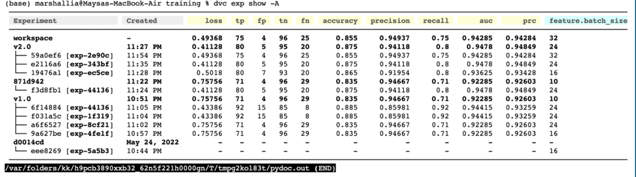
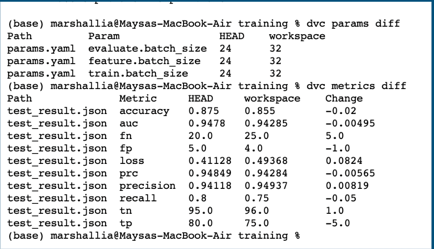
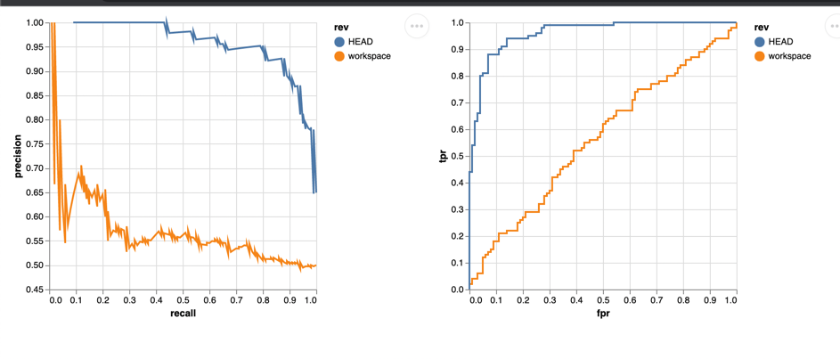
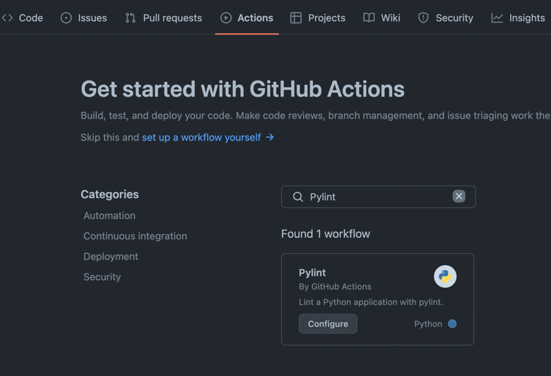
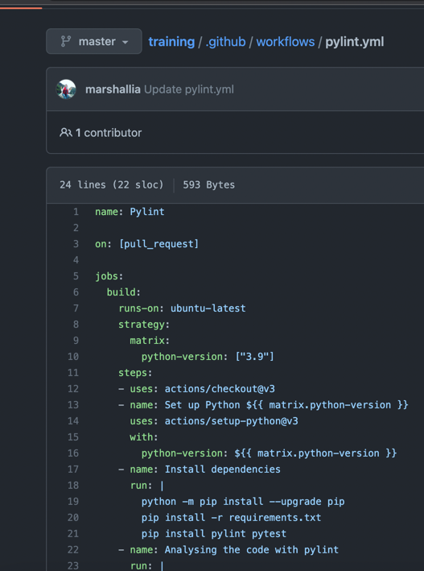
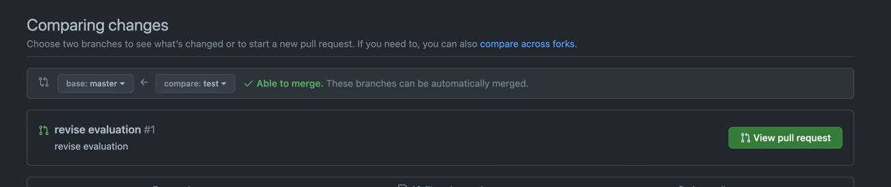
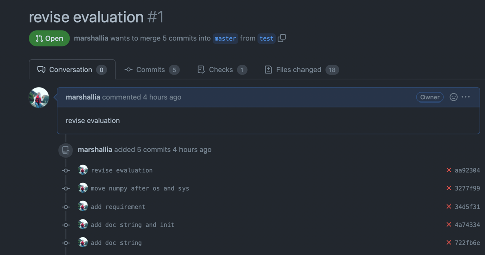

# Training COA

This repository is created as a training material for COA member.

## Description

This training will include data versioning using DVC from iterative, creating a testcase,
GitHub Management.

## Getting Started

### Requirement

* Before start training please fork this repository to your own GitHub account
* Make sure that your system has python v2.9
* Download initial data set. This dataset containing images of cats and dogs. 1000 for training, 600 for validation, and 200 for test

```
$ dvc get https://github.com/iterative/dataset-registry \
          tutorials/versioning/data.zip
$ unzip -q data.zip
$ rm -f data.zip
```

### Installing

* Step by StepTo be able to run the script you need to install all required package listed in requirement.txt

```
$ pip install -r requirements.txt
```
 * Initialize dvc inside your local directory
```
$ dvc init
```
## Step by Step Training

### Try Data Management

Here we will learn how to use several data set to produce a different model and push dataset to remote storage
#### Add data to dvc cache
```
$ dvc add data
```
#### Create remote storage
Create a folder in your remote storage. it can be a amazon S3 or gDrive. Then add it to your project
```
$ dvc remote add $ dvc remote add --default cicd gdrive://1dYU8Y-4jjlNC30mQoJq67GyE9xUsb9Fa
$ dvc push
```
#### Data Versioning
 * Create model v1 using initial dataset.
```
$ python train.py
```
 * Save the model and tag it as first version
```
$ dvc add model.h5
$ git commit -m "First model, trained with 1000 images"
$ git tag -a "v1.0" -m "model v1.0, 1000 images”
```
 * Download more images to increase dataset size. Now you have 2000 images of training.
```
$ dvc get https://github.com/iterative/dataset-registry \
          tutorials/versioning/new-labels.zip
$ unzip -q new-labels.zip
$ rm -f new-labels.zip
```
 * Re-train the network using new dataset, add to dvc cache, commit, and tag
```
$ python train.py
$ dvc add model.h5
$ git commit -m "Second model, trained with 2000 images"
$ git tag -a "v2.0" -m "model v2.0, 2000 images”
```
#### Switching between data version
 * Check out to old code and dataset
```
$ git checkout v1.0
$ dvc checkout
```
 * Checkout with current code and old dataset
```
$ git checkout v1.0 data.dvc
$ dvc checkout data.dvc
```
### Try Experiment Management
The experiment is used to track the experiment you have done so far, including the dataset you use, the result, and dataset. You also can share you experiment in github by publish your dvc experiment
The experiment management is a bit complicate, we need to create several file to run it.
#### Create Data Pipeline
A data pipeline consist of several stage that represent the experiment flow, ex preprocessing, feature extraction, training, evaluation, testing, etc.
In this training we will use 3 stages, featurize, training, and evaluate. 
Featurize is used to extract the feature from the dataset. Training is used to train the top layer of the network, and the evaluate is used to evaluate the result and save the metrics information.
 * Create a featurize stage
```
$ dvc stage add -n featurize \
                -p feature.batch_size,feature.img_width,feature.img_height \
                -d src/featurization.py -d data \
                -o feature \
                python src/featurization.py data feature
```
 * Create a training stage
```
$ dvc stage add -n train \
                -p train.batch_size,train.epochs,train.dropout,train.optimizer,train.model_name \
                -d src/training.py -d data feature\
                -o model.h5 \
                -m metrics.csv
                python src/training.py feature

```
 * Create a evaluate stage
```
$ dvc run -n evaluate \
          -p evaluate.batch_size,evaluate.model_name\
          -d src/evaluate.py -d feature -d model.h5 \
          -M test_result.json \
          --plots-no-cache plot/prc.json \
          --plots-no-cache plot/roc.json \
          python src/evaluate.py model.h5 feature plot
```
Those stage will produce a dvc.yaml file that run our experiment automatically.
The other way to create it is by type is by your self. there is a [sample_dvc.yaml](sample_dvc.yaml) to assist you if you want to create one by your self
 * To run the  dvc.yaml you can run dvc repro command. it will run the experiment design with all its parameter. and you can reproduce the result multiple times. 
If there is no change in the parameter, code, or dependencies, then the stage will bw skipped. and only run the stage that changes
```
$ dvc repro
```

#### Run experiment
This is one of the cool stuff from dvc. The experiments will help you to record any change in your hyperparameter, metrics result, and your data version. Since you already have dvc.yaml you just need to run the command below to star record the experiments.
```
$ dvc exp run
```
Try to modify your hyperparameter and check the result on the recorded metric. Below is the example changing the dropout and display the recorded experimets.
```
$ dvc exp run --set-param training.dropout=.3
4 dvc exp show
```
* Change multiple hyperparameter
```
$ dvc exp run --S feature.batch_size=16 --S training.batch_size=16 --S evaluate.batch_size=16
4 dvc exp show
```

* Compare metrics result
```
$ dvc metrics show
$ dvc metrics diff
```
* Remove experiment
```
$dvc remove exp-id
```
When you run the experiment with set parameter it will automatically update the params.yaml. 

### Visualization
DVC provide visualization by ceating a html file from json file. However the json file should meet certain format so it can be execute
In this tutorial we will create a visualization of PRC adn ROC curve.
 * sample format can be seen in [sample_prc.json](plot/sample_prc.json) and [sample_roc,json](plot/sample_roc.json).
 * Visualise the saved points
```
$ dvc plots show
```
 * Plot comparison from two different experiments
```
$ dvc metrics diff
$ dvc plots diff
```



## Tagging you result
Since you have done a lot of experiment you can select your best experiment and save the result then tag it for release.
```
$ git commit -a
$ git tag -a "v3.0" -m "model v3.0, , fine-tuned”
$ git push origin --tags
```
You also can share your experiment journey with team member by pushing your experiment record.
```
$ dvc exp push origin # to push
$ dvc exp pull # to get others experiments
```
## Test Your Code
### Why test your code?
* Working with multiple person 
* Make sure the logic of code is correct 
* Prevent accidental changes 
* Reduced maintenance and software support costs 
* Improved quality of software and user experience 
* Higher quality products lead to more satisfied customers.
For sample test case please check [test folder](test)

## Create CI using GitHub Action
### GitHub Action Benefit
1. CI/CD tool for the GitHub flow
2. Hosted virtual machines on multiple operating systems
3. Pre-written CI templates 
4. Simple container management

#### Create a GitHub Action
GitHub has many CI templates you can select. Go action tab from your repo and search the template.
For this training let's use the PyLint to check the python code standard

Please modify the state of the action from push to pull-request


 * Create your Pull Request
Pull Requests are a mechanism to notify other team member that they have completed a feature branch. By using pull request team member can discuss about the code, check commit history, and check the CI status.
Please remember that pull request is done from a feature branch to master branch.
Any advises for common problems or issues? Please contact author.
To create pull request, go to tab pull request. select the branch you want to compare and create a pull request



## Slide and Homework
For ppt and homework detail please check [this link](https://docs.google.com/presentation/d/1llfWtPO3l5qnfrxyUXXwCq9IUptMxuqiHGZk9nW9phY/edit?usp=sharing)
## Authors

Contributors names and contact info

Maysa Marshallia  
[marshallia@g.ncu.edu.tw](marshallia@g.ncu.edu.tw)

## Acknowledgments
* [DVC](https://dvc.org/) by iterative 
* [GitHub Action](https://github.com/features/actions) 
